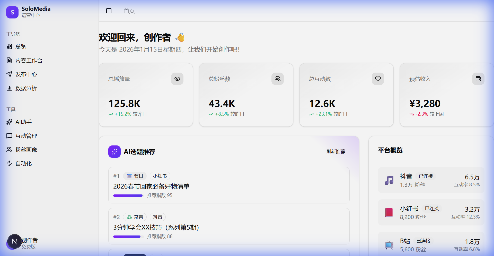
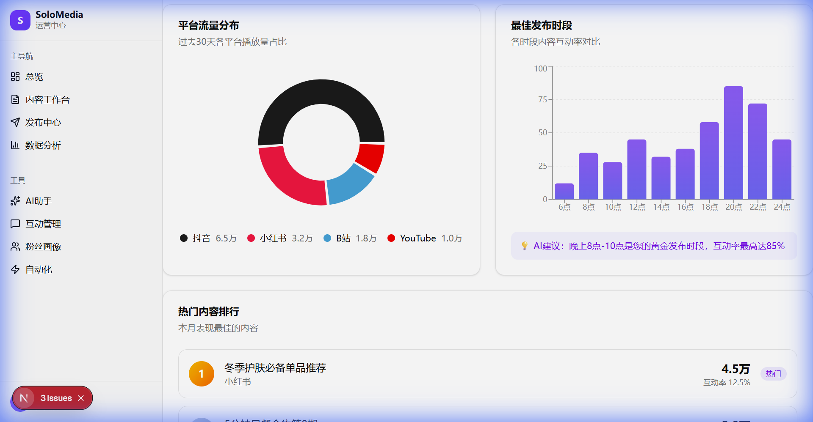
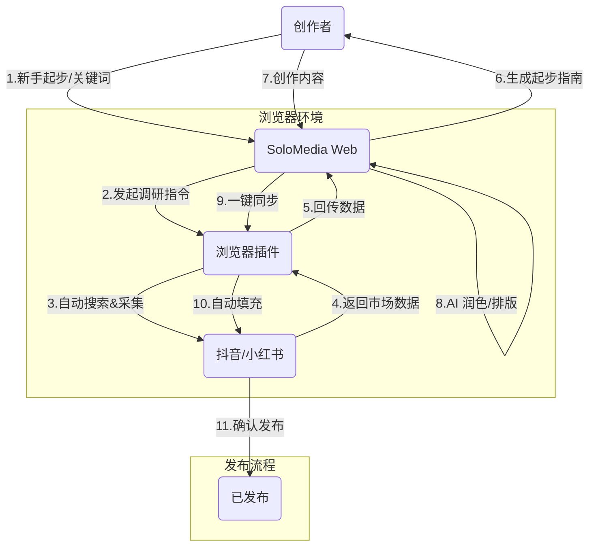

# 🚀 SoloMedia - 个人自媒体运营中心

> **"一人军团"的AI驱动多平台内容运营SaaS**
> 
> **当前状态**: 🚀 Alpha v0.3.1 (已就绪) - 认证/数据库/API已打通

帮助个体创作者以最低成本实现专业级多平台运营，让每一个人都能成为高效的内容创业者。

---

## 📸 产品预览

### Dashboard 运营总览


### 数据分析看板


---

## 💡 项目愿景

在自媒体时代，个人创作者面临着巨大挑战：

| 用户痛点 (Pain) | 传统解决 (Old Way) | SoloMedia 方案 (New Way) | 核心功能映射 |
|---|---|---|---|
| **🌱 新手起步迷茫** | 不知道做什么方向，没粉丝没内容，甚至不敢开始 | **Zero Guidance**：盲目模仿，容易放弃，不仅没流量还甚至被封号 | `Niche Analysis` 赛道分析 |
| **🔥 多平台管理混乱** | 频繁切换APP，账号密码遗忘，消息漏回 | **Unified Hub**：一站式管理所有账号，聚合消息收件箱 | `Inbox` 统一收件箱 |
| **🤯 创作灵感枯竭** | 对着屏幕发呆，不知道写什么，追热点慢 | **AI Co-pilot**：智能选题推荐，热点实时捕捉，AI辅助写作 | `AI Assistant` 创作助手 |
| **⏰ 运营效率低下** | 手动分发，重复机械劳动，忘记回评论 | **Automation**：一键多平台发布，自动回复，定时任务 | `Automation` 自动化 |
| **📊 数据复盘困难** | Excel手动统计，无法跨平台对比效果 | **Data Central**：全平台数据聚合，可视化报表，智能归因 | `Analytics` 数据看板 |
| **💰 资源管理分散** | 素材丢在硬盘各个角落，找图难 | **Cloud Asset**：云端素材库，标签化管理，跨设备同步 | `Media` 素材库 |

---

## 🗺️ 用户旅程 (User Journey) - 自动化模式 (New)

SoloMedia 采用 **RPA (Robotic Process Automation)** 技术，通过浏览器插件或客户端实现"非侵入式"的自动发布与数据采集。



### 环节详解

#### 1. 🎯 灵感与规划 (Plan) - **Agentic Research**
- **智能调研**：输入关键词（如"数码测评"），**浏览器插件**将模拟用户行为，自动在抖音/小红书搜索并抓取前 50 条爆款数据。
- **AI 分析**：SoloMedia 对抓取数据进行深度分析，生成《新手起步指南》，告诉你该拍什么、怎么拍。
- **通过数据决策**：告别盲目模仿，基于真实市场数据确定赛道与选题。

#### 2. ✍️ 创作与管理 (Create)
- **一键填充**：在 Web 端点击发布，插件自动接管浏览器，打开对应平台创作中心，填入标题、内容、话题标签并上传封面。
- **数据回流**：当您浏览平台后台时，插件自动采集播放量、点赞数等核心指标，生成跨平台报表。

### 核心特性

#### 1. 🤖 浏览器自动驾驶 (Auto-Pilot)
- **拒绝 API 限制**：无需申请官方 API 权限，直接模拟用户操作。
- **一键填充**：在 Web 端点击发布，插件自动接管浏览器，打开对应平台创作中心，填入标题、内容、话题标签并上传封面。
- **数据回流**：当您浏览平台后台时，插件自动采集播放量、点赞数等核心指标，生成跨平台报表。

#### 2. 🛡️ 安全第一
- **本地 Cookie**：所有登录凭证仅存储在您的浏览器本地，不上传服务器。
- **防关联**：使用即用即走的插件模式，完全模拟真人操作频率，极大降低封号风险。

---

## 🛠️ 技术栈

| 层级 | 技术 |
|------|------|
| **前端** | Next.js 16, React 19, TailwindCSS, Shadcn/UI |
| **插件** | Chrome Extension (Manifest V3), React, Vite |
| **后端** | Hono, Node.js 20, TypeScript |
| **AI服务** | 阿里云通义千问 (Qwen-Max/Plus) |
| **数据库** | PostgreSQL + Drizzle ORM + SQLite (Local) |

---

## 📁 项目结构

```
solopreneur/
├── apps/
│   ├── web/              # Next.js 创作工作台
│   ├── api/              # 后端服务
│   ├── extension/        # [NEW] 浏览器自动化插件
│   └── desktop/          # [Planned] Electron 客户端
├── packages/
│   ├── ai/               # AI Agent
│   └── shared/           # 通用类型
└── deploy/               # 部署配置
```

---

## 🚀 快速开始

### 1. 启动 Web 服务
```bash
pnpm install
pnpm dev
```

### 2. 加载浏览器插件
1. `cd apps/extension && npm run build`
2. Chrome 开启开发者模式 -> 加载 `dist` 文件夹
3. Pin 住插件图标，开启自动化之旅！

---

## 🛣️ 产品蓝图

- [x] 核心创作功能 (编辑器/AI)
- [x] **自动化可行性验证**
- [ ] **Phase 1: 浏览器插件 (v0.5)**
    - [ ] 抖音/小红书 自动填充
    - [ ] 播放量数据抓取
- [ ] **Phase 2: 桌面客户端 (v1.0)**
    - [ ] 封装 Electron
    - [ ] 后台定时任务队列
- [ ] **Phase 3: 矩阵管理**
    - [ ] 多账号切换
    - [ ] 团队协作

---

## 📄 License

MIT
