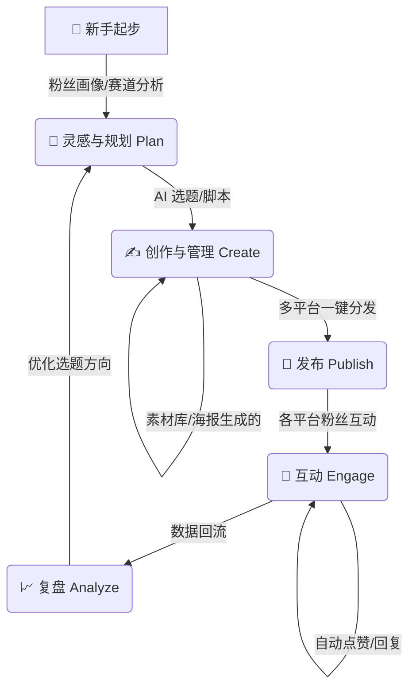

# 🚀 SoloMedia - 个人自媒体运营中心

> **"一人军团"的AI驱动多平台内容运营SaaS**
> 
> **当前状态**: 🚀 Alpha v0.3.1 (已就绪) - 认证/数据库/API已打通

帮助个体创作者以最低成本实现专业级多平台运营，让每一个人都能成为高效的内容创业者。

---

## 📸 产品预览

### Dashboard 运营总览


### 数据分析看板


---

## 💡 项目愿景

在自媒体时代，个人创作者面临着巨大挑战：

| 用户痛点 (Pain) | 传统解决 (Old Way) | SoloMedia 方案 (New Way) | 核心功能映射 |
|---|---|---|---|
| **🌱 新手起步迷茫** | 不知道做什么方向，没粉丝没内容，甚至不敢开始 | **Zero Guidance**：盲目模仿，容易放弃，不仅没流量还甚至被封号 | `Niche Analysis` 赛道分析 |
| **🔥 多平台管理混乱** | 频繁切换APP，账号密码遗忘，消息漏回 | **Unified Hub**：一站式管理所有账号，聚合消息收件箱 | `Inbox` 统一收件箱 |
| **🤯 创作灵感枯竭** | 对着屏幕发呆，不知道写什么，追热点慢 | **AI Co-pilot**：智能选题推荐，热点实时捕捉，AI辅助写作 | `AI Assistant` 创作助手 |
| **⏰ 运营效率低下** | 手动分发，重复机械劳动，忘记回评论 | **Automation**：一键多平台发布，自动回复，定时任务 | `Automation` 自动化 |
| **📊 数据复盘困难** | Excel手动统计，无法跨平台对比效果 | **Data Central**：全平台数据聚合，可视化报表，智能归因 | `Analytics` 数据看板 |
| **💰 资源管理分散** | 素材丢在硬盘各个角落，找图难 | **Cloud Asset**：云端素材库，标签化管理，跨设备同步 | `Media` 素材库 |

---

## 🗺️ 用户旅程 (User Journey)

SoloMedia 为创作者打造了全链路的闭环工作流：



### 环节详解

#### 1. 🎯 灵感与规划 (Plan)
- **新手痛点**：不知道做什么内容。
- **解决方案**：**粉丝画像 (`/audience`)** 帮你定位受众，**AI 助手 (`/ai-assistant`)** 帮你头脑风暴，从 0 到 1 确定赛道。

### 2. ✍️ 创作与管理 (Create)
- **素材库 (`/media`)**：集中管理视频、图片素材，支持拖拽上传和预览。
- **内容工作台 (`/content`)**：
    - 使用 **Rich Editor** 撰写图文/文章。
    - 使用 **Poster Generator** 一键生成精美封面。
    - 关联素材，准备发布内容。

### 3. 🚀 发布与分发 (Publish)
- **发布中心 (`/publish`)**：一键分发到抖音、小红书、B站、公众号。
- **定时发布**：设置好时间，系统自动执行，解放你的周末。

### 4. 🤝 互动与增长 (Engage)
- **统一收件箱 (`/inbox`)**：聚合所有平台的评论和私信，不错过任何互动机会。
- **自动化规则 (`/automation`)**：设置自动点赞、自动回复关键词，7x24小时维护粉丝关系。

### 5. 📈 复盘与优化 (Analyze)
- **总览看板 (`/dashboard`)**：每天看一眼核心指标（粉丝数、阅读量、互动率）。
- **趋势分析 (`/analytics`)**：发现哪些内容火了，为什么火，指导下一次创作。

---

## 🛠️ 技术栈

| 层级 | 技术 |
|------|------|
| **前端** | Next.js 16, React 19, TailwindCSS, Shadcn/UI, TipTap |
| **后端** | Hono, Node.js 20, TypeScript, JWT Auth |
| **数据库** | PostgreSQL + Drizzle ORM + Redis (BullMQ) |
| **AI服务** | 阿里云通义千问 (Qwen-Max/Plus) |
| **部署** | Docker Compose, Aliyun ECS |

---

## 📁 项目结构

```
solopreneur/
├── apps/
│   ├── web/              # Next.js Web应用 (Client & Auth UI)
│   ├── api/              # Hono API服务 (JWT Secured)
│   └── miniprogram/      # 微信小程序
├── packages/
│   ├── ai/               # AI服务 (OpenAI SDK + Qwen)
│   ├── database/         # Drizzle ORM Schema
│   └── shared/           # 共享类型 (Zod Schemas)
└── deploy/               # Docker配置
```

---

## 🚀 快速开始

```bash
# 安装pnpm
npm install -g pnpm

# 安装依赖
pnpm install

# 启动开发
pnpm dev

# 访问
# Web: http://localhost:3000
```

---

## 🛣️ 产品蓝图

- [x] MVP核心UI
- [x] AI服务对接 (Qwen)
- [x] 编辑器组件 (TipTap)
- [x] 数据库连接 (PG + Redis)
- [x] 用户认证 (JWT + WeChat)
- [ ] 生产环境部署 (Docker Ready)
- [ ] 抖音/小红书平台接入

---

## 📄 License

MIT
