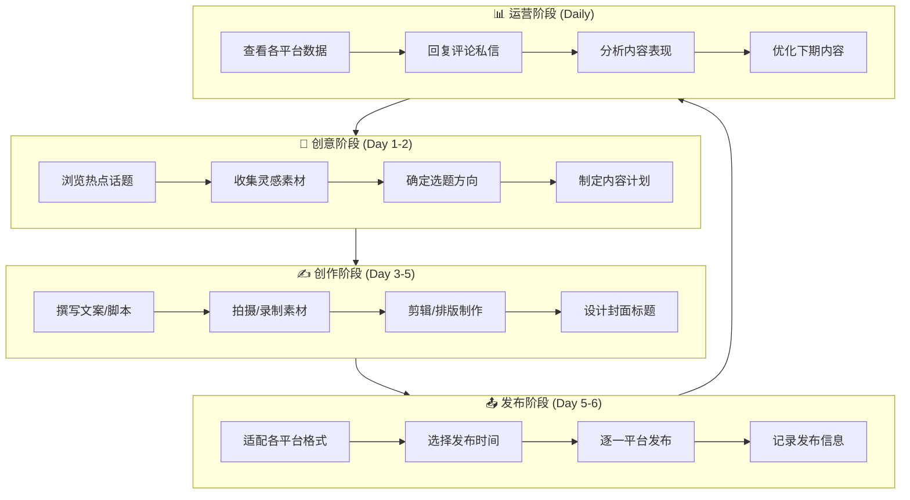

# 🚀 SoloMedia - 个人自媒体运营中心

> **"一人军团"的AI驱动多平台内容运营SaaS**

帮助个体创作者以最低成本实现专业级多平台运营，让每一个人都能成为高效的内容创业者。

---

## 💡 项目愿景

在自媒体时代，个人创作者面临着巨大挑战：
- 🔥 **多平台分散** - 抖音、小红书、B站、视频号...每个平台都需要登录和管理
- ⏰ **时间碎片化** - 内容创作、发布、互动、数据分析...时间严重不足
- 📊 **数据孤岛** - 各平台数据分散，无法形成全局洞察
- 💰 **成本限制** - 专业工具订阅费用高昂，个人难以承受

**SoloMedia** 的使命是让每一位个体创作者都能：
- ✅ 一个后台管理所有平台
- ✅ AI辅助完成80%的日常运营工作
- ✅ 数据驱动决策，科学增长
- ✅ 低成本甚至免费使用

---

## 🎯 核心用户：个人自媒体人

### 用户画像
| 特征 | 描述 |
|------|------|
| **身份** | 个体创作者、斜杠青年、知识博主、生活分享者 |
| **平台数** | 同时运营 3-5 个平台账号 |
| **时间** | 兼职创作，每天可投入 2-4 小时 |
| **预算** | 月预算 ≤ 200 元 |
| **目标** | 副业变现、个人品牌、流量积累 |

### 核心痛点
```
1. 💭 选题困难    - 不知道发什么，缺乏灵感
2. ✍️ 创作低效    - 写文案、剪视频耗时太长
3. 📤 发布繁琐    - 多平台重复登录、适配、发布
4. 📉 数据分散    - 各平台数据无法统一查看分析
5. ⏰ 时间不足    - 回复评论、私信占用大量时间
6. 💡 缺乏指导    - 不知道如何优化提升
```

---

## 📋 自媒体人日常SOP（标准作业流程）



### SoloMedia 如何赋能每个环节

| SOP阶段 | 痛点 | SoloMedia解决方案 |
|---------|------|-------------------|
| **创意阶段** | 不知道发什么 | 🤖 AI热点追踪 + 选题推荐 |
| **创作阶段** | 写文案太慢 | 🤖 AI脚本生成 + 标题优化 |
| **发布阶段** | 多平台重复劳动 | ⚡ 一键多平台分发 |
| **运营阶段** | 数据分散 | 📊 统一数据看板 |

---

## 🛠️ 系统架构

```
┌─────────────────────────────────────────────────────────────┐
│                        用户终端                               │
├──────────────────┬────────────────────┬────────────────────┤
│   🌐 Web后台      │   📱 微信小程序     │   🔌 浏览器插件     │
│   (Next.js)      │   (原生)           │   (Chrome)        │
└─────────┬────────┴────────┬───────────┴────────┬───────────┘
          │                 │                    │
          └────────────────┼────────────────────┘
                           ▼
┌─────────────────────────────────────────────────────────────┐
│                     🔧 API服务层                              │
│                     (Hono + Node.js)                        │
├──────────┬──────────┬──────────┬──────────┬────────────────┤
│ 用户认证  │ 内容管理  │ 发布调度  │ 数据分析  │    AI服务     │
└────┬─────┴────┬─────┴────┬─────┴────┬─────┴───────┬────────┘
     │          │          │          │             │
     ▼          ▼          ▼          ▼             ▼
┌─────────────────────────────────────────────────────────────┐
│                     💾 数据存储层                              │
├───────────────┬───────────────┬─────────────────────────────┤
│  PostgreSQL   │     Redis     │     阿里云 OSS              │
│  (业务数据)    │  (缓存/队列)   │     (媒体文件)               │
└───────────────┴───────────────┴─────────────────────────────┘
                           │
                           ▼
┌─────────────────────────────────────────────────────────────┐
│                     🔗 平台连接层                              │
├─────────┬─────────┬─────────┬─────────┬─────────┬──────────┤
│ 抖音     │ 小红书   │ B站     │ 视频号   │ YouTube │ 更多...  │
└─────────┴─────────┴─────────┴─────────┴─────────┴──────────┘
```

---

## 📊 核心数据模型

### 需要采集的数据

| 数据类型 | 数据项 | 用途 |
|----------|--------|------|
| **账号数据** | 粉丝数、关注数、获赞数 | 成长趋势分析 |
| **内容数据** | 播放量、点赞、评论、分享、收藏 | 内容效果评估 |
| **用户数据** | 粉丝画像、活跃时段 | 精准运营 |
| **收益数据** | 创作收益、带货佣金 | 变现追踪 |
| **互动数据** | 评论、私信、@提及 | 粉丝互动管理 |

---

## 🗂️ 项目结构

```
solopreneur/
├── apps/
│   ├── web/              # Next.js Web管理后台
│   │   └── src/
│   │       ├── app/      # 页面路由
│   │       └── components/
│   │           ├── dashboard/   # 仪表盘组件
│   │           ├── editor/      # 编辑器组件
│   │           └── ui/          # 基础UI组件
│   ├── api/              # Hono API服务
│   │   └── src/
│   │       ├── routes/   # API路由
│   │       └── services/ # 业务服务
│   └── miniprogram/      # 微信小程序
│
├── packages/
│   ├── ai/               # AI服务封装 (OpenAI SDK + Qwen)
│   ├── database/         # 数据库Schema (Drizzle ORM)
│   └── shared/           # 共享类型和工具
│
├── deploy/               # 部署配置
│   ├── docker-compose.yml
│   ├── nginx/
│   └── scripts/
│
├── package.json
├── pnpm-workspace.yaml
└── turbo.json
```

---

## 🚀 快速开始

### 环境要求
- Node.js 20+
- pnpm 9+
- PostgreSQL 16+
- Redis 7+

### 本地开发
```bash
# 安装pnpm
npm install -g pnpm

# 安装依赖
pnpm install

# 配置环境变量
cp deploy/.env.example deploy/.env

# 启动开发服务器
pnpm dev

# Web: http://localhost:3000
# API: http://localhost:3001
```

### 生产部署
```bash
# SSH到阿里云ECS
ssh root@your-server-ip

# 初始化服务器
./deploy/scripts/setup.sh

# 部署应用
./deploy/scripts/deploy.sh
```

---

## 🛣️ 产品蓝图

### MVP v0.1 (当前)
- [x] 项目架构搭建
- [x] 基础UI框架 (Dashboard)
- [x] AI服务对接 (通义千问)
- [x] 编辑器组件 (TipTap)
- [ ] 数据库连接
- [ ] 用户认证

### v0.2 内容闭环
- [ ] 内容创建和管理
- [ ] AI辅助创作 (选题/文案/标题)
- [ ] 素材库 (OSS)
- [ ] 草稿和版本管理

### v0.3 发布能力
- [ ] 微信公众号发布
- [ ] 多平台适配转换
- [ ] 定时发布调度
- [ ] 发布状态追踪

### v0.4 数据运营
- [ ] 多平台数据同步
- [ ] 数据可视化看板
- [ ] AI洞察建议
- [ ] 定期数据报告

### v0.5 增长变现
- [ ] 评论私信聚合
- [ ] 粉丝画像分析
- [ ] 收益追踪统计
- [ ] 商业合作对接

### v1.0 正式发布
- [ ] SaaS订阅系统
- [ ] 小程序上线
- [ ] 更多平台支持
- [ ] 企业版功能

---

## 🤝 技术栈

| 层级 | 技术选型 |
|------|----------|
| **前端** | Next.js 16, React 19, TailwindCSS, Shadcn/UI, TipTap |
| **后端** | Hono, Node.js 20, TypeScript |
| **数据库** | PostgreSQL + Drizzle ORM |
| **缓存队列** | Redis + BullMQ |
| **AI服务** | 阿里云通义千问 (OpenAI SDK兼容) |
| **存储** | 阿里云OSS |
| **部署** | Docker, Nginx, 阿里云ECS |

---

## 📄 License

MIT License

---

**让每一位创作者都能轻松运营，专注内容本身。** 🎨
